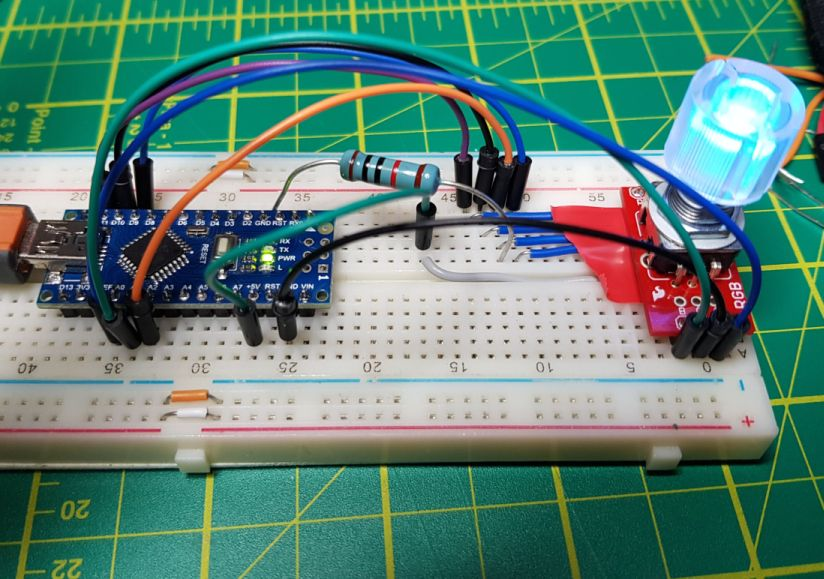
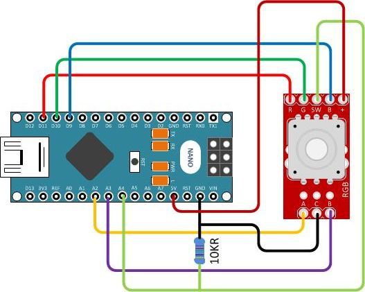

# Arduino Nano with RGB Rotory Encoder 

## Introduction

I wanted to use an RGB Illuminated Rotary Encoder for a project but I didn't 
know how they worked. This project is a simple test project to explore the
hardware and functionality.

## Hardware

Components              | Src  | Cost  | Notes
------------------------|------|-------|--------------------------------------
Arduino Nano            | 1    | £2.41 | V3 Compatible ATMEGA328P CH340
Rotary Encoder Breakout | 1    | £3.99 | Board - Illuminated (RG/RGB)
Rotary Encoder RGB      | 1    | £4.99 | Illuminated, came with knob.
Resistor                | ?    | ?     | 10KR
Breadboard              | ?    | ?     | One of many 
Bread board wires       | ?    | ?     | Several

### Sources
1. Ebay.co.uk - although I bought the components last year, so prices may no
longer be accurate. 

## Construction

This is the breadboard construction, it's not very tidy but it works.



And here is a tidier diagram of the connections between the RGB Rotary Encoder
and Arduino Nano.



Note the resistor pulling down the wire from 'SW' on the Rotary Encoder Breakout
board. I found this necessary to stop the input floating around.

## References

[Ardino UNO Tutorial 6 - Rotary Encoder](http://www.hobbytronics.co.uk/arduino-tutorial6-rotary-encoder)

This tutorial gave me the basics of reading the encoder part, and is worthwhile
to understand how the encoder works.

[RGB ROTARY ENCODER TEST (Arduino)](https://www.youtube.com/watch?v=oBWHV_Ag-f8)

This youtube video by TETRASTYLE was interesting but the link to the 
[sample code](http://djgj.sub.jp/TETRASTYLE/arduino/rot_enc_rgb.txt) 
helped me understand how to control the RGB and Switch. 

## User Instructions

1. Run the example code attached to the Arduino Serial Monitor

2. The program will output instrumentation indicating when the setup function 
has started and completed.

3. It will then output the analogue PWM output values for the 'R', 'G' and 'B' 
pins.

4. Turning the encoder knob will increment or decrement the first output value 
in steps of 15, up to 255 or down to 0, where it will circle around. 

5. Pressing down on the knob will switch to the next PWM value so that it can
be incremented or decremented. 

Example Serial Output...

```
    Setup started.
    Setup completed.
   R:255, G:240, B:255
   R:255, G:255, B:255
   R:255, G:0, B:255
   R:255, G:0, B:240
   R:255, G:0, B:255
   R:255, G:0, B:0
```


## Interesting Issues

The encoder part worked out of the box with no issues.

However, the RGB LED and push Switch gave me a lot of trouble. I'm not an 
electrical engineer at all, so I learned quite a bit I think.

### RGB LED didn't work

I couldn't find any examples of how to connect the RGB LED to an Arduino, 
despite TETRASTYLE's code and video. I found the [schematic](https://dlnmh9ip6v2uc.cloudfront.net/datasheets/BreakoutBoards/RG-RGB-Encoder-v10.pdf) for the board
and it indicated the '+' was 'common', which I took to mean ground. 

But when I connected that pin to Ground and the 'R', 'G', and 'B' pins to PWM
output pins of the Nano, I got nothing.

Playing around I eventually worked out (by trial and error) that the '+' is a 
common +5V input and connecting the 'R', 'G' and 'B' pins to Ground is
what illuminated the respective LED!

The interesting thing is that I could still use the PWM output pins to drive the
LED, but in reverse. That is, an output of 255 on a PWM pin would turn the 
associated LED colour off, where as an output value of 0 would allow the LED
to be at full brightness. 

TETRASTYLE's [sample code](http://djgj.sub.jp/TETRASTYLE/arduino/rot_enc_rgb.txt)
shows the same thing, I just didn't understand it at the time.

### The SW Pin Floats

Pressing the encoder knob down should activate the 'SW' pin. I had it connected
as a simple digital input but the problem was that when I rotated the knob it 
was as if the switch was activating all the time.

Putting a PRINT on the pin read value showed the issue. 
* When pushed down it was a steady 1 (HIGH)
* When not pushed down, the input floated between 1 and 0 (HIGH and LOW).

The fix was to add a 10KR Resistor between the SW pin and ground. You can 
configure Arduino Inputs to be Pullup inputs (e.g. HIGH when they float) but
not Pulldown inputs (LOW when the float). This is what adding the resistor 
does.  


